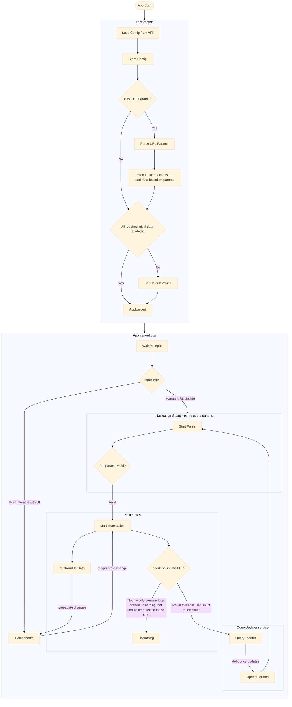

# router_example

[](https://aboutroots.github.io/vue-router-example/coverage/)
[](https://vue-router-example.vercel.app)

The app is available at: https://vue-router-example.vercel.app

## this is a demo of:

- vue 2.6 "crm-like" app with TS + pinia
- application state driving URL params `App → Store → Route (reflecting state)`
- single service for updating URL params based on state, with:
  - prevention of duplicated navigation
  - batching almost-simultaneous updates into one
- single service for detecting changes to the URL params and applying appropriate actions
- single service for loading and setting initial application values at the startup
- ability to fetch data on demand via the store
- generic modals driven by modals store
  - modals are unmounted when not used
  - fade in vue transition, css-only
- global loading state accessible from all places
- example unit tests in place
- no teleport used
- no watchers used
- no jquery

## Data flow



## Project setup

```
yarn install
```

### Compiles and hot-reloads for development

```
yarn serve
```

### Compiles and minifies for production

```
yarn build
```

### Run your unit tests

```
yarn test:unit
```

### Run tests with coverage report

```
yarn test:coverage
```

### Lints and fixes files

```
yarn lint
```
